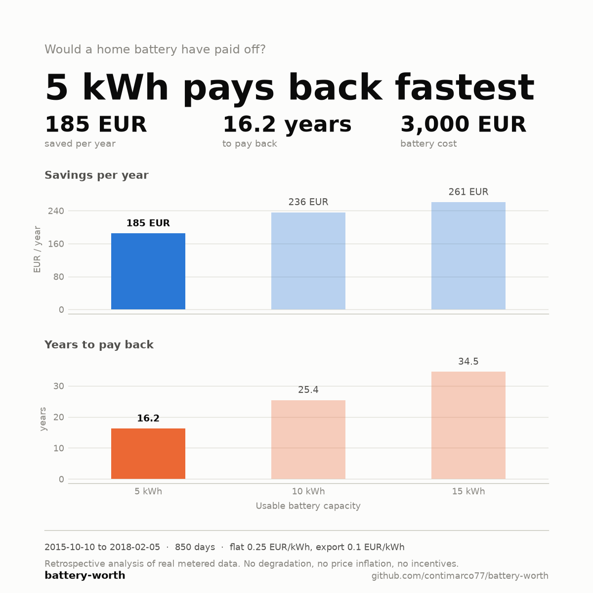
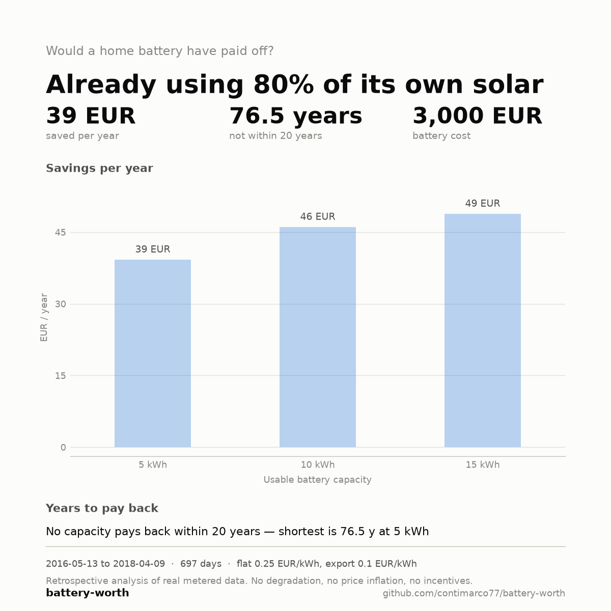

# battery-worth

*Would a home battery have paid off? Retrospective analysis of your own metered data — annual savings, payback and self-consumption across battery sizes.*

[](https://opensource.org/licenses/Apache-2.0)



Feed it your historical import / export / PV data — a Home Assistant export or a
generic CSV — and get a Markdown report and a shareable summary card. Runs
entirely offline.

**Status.** The engine is complete and tested: CSV ingest (both schemas, DST,
gaps, cumulative meters), the greedy simulator, the capacity sweep, flat /
Italian F1-F2-F3 / hourly-price tariffs, export-price sensitivity, seasonal
breakdown, the Markdown report and the PNG summary card all work end to end from
the command line, and a container image is built. 363 tests, `ruff` and
`mypy --strict` clean.

Deliberately out of scope for v0.1: the optional `--llm` commentary layer,
deferred to v0.2, and any native Home Assistant or inverter parser — HA data
comes in through [the standalone export
script](#exporting-from-home-assistant), everything else through generic CSV.
Not published to PyPI; install from source.

## Why

Battery vendors quote savings. Savings are not the question — the question is
whether the savings ever exceed the price of the box.

- **The largest battery saves the most and is usually the worst investment.**
  Every run sweeps a range of capacities and reports savings *and* payback for
  each, side by side, because those two numbers point in opposite directions and
  a tool that shows only the first is selling something.
- **The dominant factor is the import/export spread, not the battery.** Every
  report includes a sensitivity table across export prices, because the same
  house with the same battery can pay back in 10 years or in 23 depending on
  what your utility pays for exported energy. Greedy self-consumption never
  reads a price, so the energy flows are identical at every export price and
  only the costing changes — the whole table is re-costed in closed form from
  one simulation, exactly rather than approximately.
- **Sometimes the honest answer is that no battery helps.** A house already
  self-consuming most of its own production has very little surplus left to
  store. The tool says so plainly rather than recommending the least-bad size.

  

- **Retrospective, not predictive.** Every figure comes from energy that
  actually flowed through your meter. Nothing is modelled forward, nothing is
  extrapolated from a typical-year profile, and the report states the period and
  day count it is based on. If you would rather watch a simulated battery
  operate in real time,
  [battery_sim](https://github.com/hif2k1/battery_sim) does that inside Home
  Assistant, on the same physics — usable capacity, power limits, round-trip
  efficiency — and reports the energy it would have saved. The emphasis here is
  on the money instead: payback per size, and how much of it hangs on the export
  price.

## Quick start

```bash
git clone https://github.com/contimarco77/battery-worth
cd battery-worth && pip install -e .

battery-worth analyze my_energy.csv \
    --flat-price 0.25 \
    --export-price 0.10 \
    --battery-cost-per-kwh 600 \
    --timezone Europe/Rome \
    --output report.md
```

Two things worth knowing before the first run.

**Nothing is written without `--output`.** Omit it and the analysis prints to the
terminal and leaves no files behind. With it, you get `report.md` and, beside it,
`report.png` — the summary card. `--no-card` skips the card.

**`--battery-cost-per-kwh` is a rate, not a total.** A 3,000 EUR quote for a
5 kWh battery is `600`, not `3000`. It is applied to each capacity in the sweep,
which is how the sweep prices a bigger battery honestly.

Capacities default to `0,5,10,15` kWh, where `0` is the no-battery baseline.
Override with `--capacities`; a single size is `--capacities 10`.

The two cards above were produced with exactly these prices — `0.25` flat,
`0.10` export, `600` per kWh — on the [Open Power System
Data](https://data.open-power-system-data.org/household_data/2020-04-15/)
household dataset: two real homes in Konstanz, southern Germany, analysed in
`Europe/Berlin`. The card footer names the tariff but not the timezone, so it is
worth saying here.

## Configuration

Everything is a command-line flag; there is no config file. `battery-worth
analyze --help` lists all of them. The ones that matter:

**Pricing** — pick exactly one import tariff.

| Flag | Notes |
|---|---|
| `--flat-price` | One import price at all hours, EUR/kWh |
| `--f1` / `--f2` / `--f3` | Italian time-of-use bands: peak, mid, off-peak |
| `--prices-csv` | Hourly import prices (PUN or a dynamic tariff) |
| `--export-price` | What your utility pays for exported energy. Default `0.10` |
| `--export-price-sweep` | Override the prices in the sensitivity table. Default: three points around `--export-price` |
| `--battery-cost-per-kwh` | Installed cost per **usable kWh**, drives payback |

**Battery** — these are the physics, and their defaults move every figure in the
report.

| Flag | Default | Notes |
|---|---|---|
| `--capacities` | `0,5,10,15` | Usable capacities to sweep, kWh. `0` is the baseline |
| `--efficiency` | `0.9` | Round-trip efficiency, split evenly between charge and discharge |
| `--charge-power` | `5.0` | Max charge power, kW |
| `--discharge-power` | `5.0` | Max discharge power, kW |
| `--min-soc` | `0.0` | Minimum state of charge, as a fraction |

**Data** — needed whenever your CSV headers are not the defaults, which is most
CSVs that did not come from the export script.

| Flag | Notes |
|---|---|
| `--timezone` | IANA timezone of the data. Default `Europe/Rome`, **assumed and not detected** |
| `--col-timestamp`, `--col-grid-import`, `--col-grid-export`, `--col-pv-production`, `--col-consumption` | Column names. Two schemas are accepted, grid-centric and meter-centric; mixing them is an error |
| `--cumulative` / `--no-cumulative` | Force running-meter or per-interval reading. Omit to auto-detect per column |

**Output**

| Flag | Notes |
|---|---|
| `--output` | Write the Markdown report here. Without it, nothing is written |
| `--card` / `--no-card` | Write the PNG card beside `--output`. On by default |

The timezone default deserves a second look if your data is not Italian. It
decides which hours fall in which F1/F2/F3 band, so analysing German or British
data at `Europe/Rome` puts the bands on the wrong hours and prices a tariff that
does not exist. The report says so at runtime; passing `--timezone` explicitly
is the safer habit.

## Exporting from Home Assistant

battery-worth does **not** connect to Home Assistant. The analysis engine is
offline and has no network or authentication code in it at all. Instead, a
separate one-shot script pulls your history into a CSV, and the CSV is what you
analyse:

```bash
export HA_TOKEN='your-long-lived-token'

python scripts/ha_export.py \
    --url ws://homeassistant.local:8123 \
    --import-sensor sensor.grid_import_energy \
    --export-sensor sensor.grid_export_energy \
    --pv-sensor sensor.solar_energy \
    --start 2024-01-01 --end 2024-12-31 \
    -o my_energy.csv

battery-worth analyze my_energy.csv \
    --flat-price 0.28 --export-price 0.10 \
    --battery-cost-per-kwh 600 --output report.md
```

The script writes the column names battery-worth expects, so no `--col-*` flags
are needed on data that came through it. It needs only the Python standard
library — no extra install, and nothing is added to battery-worth's own
dependencies.

**Your token stays on your machine.** It is sent to the `--url` you give and
nowhere else, and it is never logged, printed, or written into the CSV. Nothing
is uploaded anywhere: both commands run entirely on your computer.

### Creating a long-lived access token

1. In Home Assistant, click your user name at the bottom of the sidebar.
2. Open the **Security** tab.
3. Scroll to **Long-lived access tokens** and click **Create token**.
4. Give it a name (e.g. `battery-worth`) and copy the value — Home Assistant
   shows it only once.

Prefer `export HA_TOKEN=...` over the `--token` flag: a token typed as a
command-line argument is saved in your shell history, which is a real leak. You
can revoke the token from the same screen once the export is done.

### Finding your statistic_ids

The script takes *statistic ids*, which for normal sensors are just their entity
ids. To find the ones your Energy Dashboard uses:

- **Settings → Devices & Services → Helpers**, or **Developer Tools →
  Statistics**, which lists every statistic the recorder keeps, or
- **Settings → Dashboards → Energy**, which shows exactly which sensors are
  configured for grid consumption, return to grid, and solar production.

If you pass an id that does not exist, the script lists the statistic ids your
instance *does* have, so you can copy the right one.

`--pv-sensor` is optional but strongly recommended: without PV production the
simulation cannot tell surplus from low consumption.

### Alternative: no token at all

Home Assistant exposes the same long-term statistics through the
`recorder.get_statistics` action, which you can call from **Developer Tools →
Actions** and copy the result out by hand. It returns the same `change` values
this script requests, so it is a workable path if you would rather not create a
token. battery-worth does not automate it.

> A note on the Energy Dashboard's own CSV download button: it is not a
> supported input. That file is transposed (timestamps run across the columns),
> its resolution depends on what you had selected in the UI, and it currently
> ships with a timezone offset bug in its header. Use the export script instead.

## Docker

```bash
docker build -t battery-worth .

docker run --rm \
    -v "$PWD:/data" \
    --user "$(id -u):$(id -g)" \
    battery-worth analyze /data/my_energy.csv \
        --flat-price 0.25 --export-price 0.10 \
        --battery-cost-per-kwh 600 --output /data/report.md
```

Two things that will bite otherwise. The terminal prints *container* paths, so
what it calls `/data/report.md` is `./report.md` on your machine. And without
`--user`, every file the container writes is owned by root.

The image is multi-stage, which buys a runtime with no pip and no compiler in
it — not a smaller image. Both stages land around 419 MB: the installed packages
are 289 MB of that, roughly 200 MB of which is pandas, numpy, matplotlib and
Pillow. No packaging trick removes them.

The Home Assistant export script ships as a sibling entrypoint rather than
inside the wheel, so the network code stays out of the analysis package:
`--entrypoint ha-export`.

## Limits and assumptions

The report carries the technical version of this list; the short form:

- **No degradation.** The battery is assumed to hold its usable capacity for the
  whole payback period. Real cells do not.
- **No price inflation.** Today's tariff is applied to every year of the payback
  estimate.
- **No incentives and no installation cost** beyond the per-kWh figure you pass.
  Subsidies, tax deductions and installer margins vary too much per country to
  be guessed at.
- **Round-trip efficiency defaults to 0.90.** It is the one physics default that
  silently moves every euro in the report — a vendor quoting 95% will show a
  shorter payback than this tool does, for that reason alone. Set `--efficiency`
  to match the quote you are comparing against.
- **Greedy self-consumption only.** The battery charges from surplus and
  discharges into demand. It never holds charge to arbitrage a price band, which
  is the right model for most households and the wrong one for some.
- **Bad data is caught, but not all of it.** Negative readings are counted and
  clipped, gaps and irregular sampling are reported, cumulative meters are
  detected and differenced, and a period under a year raises a seasonality
  warning — all of it surfaced in the report rather than fixed silently. What
  gets through is the plausible-looking kind: a stuck sensor flatlining at a
  believable value, or a spike within a believable range. If a figure looks
  impossible, check the input before trusting the output.

## Roadmap

**Shipped — v0.1**
- Greedy vectorized simulator, capacity sweep, payback per size
- Generic CSV and Home Assistant export schemas; DST, gaps, cumulative meters
- Flat, Italian F1-F2-F3 and hourly-price tariffs
- Export-price sensitivity and seasonal breakdown
- Markdown report and PNG summary card
- Container image

**Planned — v0.2**
- Optional `--llm` commentary layer, under the same strict grounding rules as
  [solar-report](https://github.com/contimarco77/solar-report): the model
  narrates figures computed in Python and never calculates one itself
- A committed real-data fixture, so the numbers in the test suite are anchored
  to a house rather than to the tool's own arithmetic
- Degradation, as an explicit assumption rather than a silent zero

## Disclaimer

battery-worth produces a **retrospective estimate**, not financial or energy
advice. It reports what a battery would have done over a period that has already
happened, on the data you supplied.

The result depends entirely on the quality of that data. The model ignores
battery degradation, energy price inflation, incentives and installation costs,
and it assumes tariffs stay as configured for the whole payback period — none of
which hold in reality. A payback figure from this tool is a starting point for a
conversation with a professional, not a substitute for one. Verify before you
buy anything.

## License

Apache License 2.0 — see [LICENSE](LICENSE).

The example cards are derived from Open Power System Data's household dataset,
published under CC BY 4.0. Attribution and details in
[`docs/assets/README.md`](docs/assets/README.md).

---

Marco Conti — software engineer, seven years in industrial software and OT/IT
integration. Reach out: ing.marco.conti@proton.me
